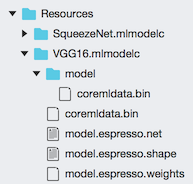

# Import a CoreML Model and Classify Images Using Different Models

## Using a CoreML Model in Xamarin

Modern machine-learning generally relies on very large multi-dimensional arrays, arranged in complex graphs. These 
models are the result of their own development process. CoreML does not have APIs for developing or training models, 
only for consuming them. 

Apple has defined a file format, .mlmodel, that stores the technique description and metadata, the graph structure, and 
the values in a single file. To use that model in a program, it must be compiled with a special tool and the 
compilation-products included in your program’s `Resources` directory or made available for download by the app.

Models can vary greatly in size. This app demonstrates two models, both intended to describe the contents of an image, 
that trade off size for accuracy. One model, SqueezeNet, is approximately 5MB. The other, VGG16, is 550MB. In this app 
you can use either model to classify either stored photos or camera images. 

VGG16 is _not_ included in the Github repository, so you _must_ follow the instructions in this file to download and 
compile it for use in the app.

## Downloading and compiling a machine learning model

This application uses two image-classification models: SqueezeNet and VGG16. The compiled SqueezeNet model is already 
included in the Github directory. VGG16 must be downloaded from [https://docs-assets.developer.apple.com/coreml/models/VGG16.mlmodel](https://docs-assets.developer.apple.com/coreml/models/VGG16.mlmodel), compiled, and included in the project before 
you can use it.

To download the 550MB VGG16, either save it from the file above or, from a terminal, run:

    wget https://docs-assets.developer.apple.com/coreml/models/VGG16.mlmodel

The CoreML compiler is included with the Xcode developer tools   (Xcode 9 and higher). To compile an .mlmodel, run:

    xcrun coremlcompiler compile {model.mlmodel} {outputFolder}

The `outputFolder` should be the Resources folder of your Xamarin iOS solution. The output of the CoreML compiler is a 
folder with a .mlmodelc extension. The contents will vary depending on the type of machine-learning algorithm used. 

Once you’ve compiled the model, you must include it in your solution. Open the sample application and in the Solution 
Pad, right-click on the Resources folder. Select “Add an existing folder…”:

And select the output folder from the CoreML compiler. Choose “Include All” and “OK” to add the files to your solution. 
Once you have done so, the Resources folder for the sample app should look like:

## Loading a Core ML model in your app

The function to load a Core ML model is [MLModel.FromUrl](https://developer.xamarin.com/api/member/CoreML.MLModel.FromUrl/p/Foundation.NSUrl/Foundation.NSError@/), so it _is_ possible to load a smaller model from the Web, but generally
 you will load it with code similar to:

	MLModel LoadModel(string modelName)  
	{  
	    NSBundle bundle = NSBundle.MainBundle;  
		var assetPath = bundle.GetUrlForResource(modelName, "mlmodelc");  
        NSError err;
        var mdl = MLModel.FromUrl(assetPath, out err);  
		if (err != null)  
		{  
		    ErrorOccurred(this, new EventArgsT\<string\>(err.ToString()));  
		}  
		return mdl;  
	}  

# Classifying Images Core ML

The sample app uses the two different image-classification models to attempt to identify the contents of an image, 
either from the Photos store or taken with the camera. The VGG16 model generally produces better results, but at a cost 
of 2 orders of magnitude in the size of the model! 

The models can take several seconds to classify an image. Classification is done asynchronously and a 
`PredictionsUpdated` event raised when new results are available. The 5 most-likely results are displayed, along with 
the model’s accuracy estimate:

## Getting Started

Core ML require macOS 10.13, iOS 11, or tvOS 11. This example project runs only in iOS 11.
